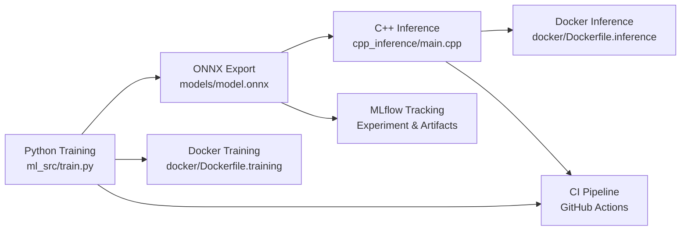

# ML & HPC Inference


<details> <summary><strong>Table of Contents</strong></summary> <ol> <li><a href="#introduction">Introduction</a></li> <li><a href="#workflow-overview">Workflow Overview</a></li> <li><a href="#dataset">Dataset</a></li> <li><a href="#prerequisites">Prerequisites</a></li> <li><a href="#installation">Installation</a></li> <li><a href="#usage">Usage</a></li> <li><a href="#outputs">Outputs</a></li> <li><a href="#docker">Docker</a></li> <li><a href="#continuous-integration">Continuous Integration</a></li> </ol> </details>

## Introduction

This project demonstrates a full ML & HPC inference pipeline, bridging the gap between Data Science research (Python) and strict Real-Time Production environments (C++), integrating:
- Training a **PyTorch** MLP model with configurable hyperparameters using **Hydra**.
- Tracking experiments and artifacts with **MLflow**.
- Exporting models to **ONNX** format for high-performance inference.
- Running inference in C++ using ONNX Runtime.
- Dockerized environments for training and inference.
- Continuous Integration (CI) via GitHub Actions.

It is designed to showcase **MLOps** practices, deployment readiness, and HPC-aware inference pipelines. 
**HPC-Ready Architecture**: the **C++** inference engine is designed to be integrated into low-latency environments (e.g., real-time control loops) where Python interpreters are not viable.

## Workflow Overview



## Dataset

The model uses a synthetic PyTorch dataset, designed to perform a simple regression task.

- The dataset can be created or loaded via `ml_src/data_loader.py`.
- Automatic batching and shuffling are handled in Python training pipeline.

## Prerequisites
- Python 3.10-3.12 recommended due to Hydra compatibility.
- PyTorch
- ONNX & ONNX Runtime
- Hydra
- MLflow
- C++17 compiler
- CMake
- Docker

Hardware accelerator recommended for training:
- NVIDIA GPU (CUDA)
- Apple MPS (for Apple Silicon)
- CPU fallback supported

## Installation

1.  **Clone the repository:**
    ```bash
    git clone https://github.com/marcolacagnina/ml-hpc-inference.git
    cd ml-hpc-inference/
    ```

2.  **Create a virtual environment (recommended)**
    ```bash
    python3 -m venv venv
    source venv/bin/activate
    ```

3.  **Install dependencies:**
    ```bash
    pip install -r requirements.txt
    ```

## Usage
**Training**
```bash
python ml_src/train.py
```
- Logs metrics, configuration, and models to **MLflow**.
- Saves PyTorch model (`models/model.pth`) and ONNX model (`models/model.onnx`).

**C++ Inference**

Build and run
```bash
cd cpp_inference/build
cmake ..
make -j$(nproc)
./onnx_inference
```
- Loads ONNX model, creates dummy input, runs forward pass.
- Supports configurable number of threads for HPC-aware inference via `cpp_inference/config.yaml` (**yaml-cpp** configuration file).

## Outputs

- `models/model.pth` → PyTorch trained weights.
- `models/model.onnx` → ONNX model for C++ inference.
- `MLflow tracking` → Hyperparameters, metrics, and artifacts.


## Docker
Training
```bash
docker build -f docker/Dockerfile.training -t ml-hpc:training .
docker run -v $(pwd)/mlruns:/app/mlruns ml-hpc:training
```

Inference (`amd64` environment)
```bash
docker build --platform linux/amd64 -t onnx-cpp-inference-x86 -f docker/Dockerfile.inference .
docker run --rm --platform linux/amd64 onnx-cpp-inference-x86
```
 
## Continuous Integration

GitHub Actions pipeline includes:

1. Python Quality & Testing
- `flake8` linting
- `pytest` for unit tests
- ONNX export verification

2. C++ Build & Inference Check
- Downloads ONNX artifact from Python job
- Builds and runs C++ inference
- Ensures end-to-end correctness


